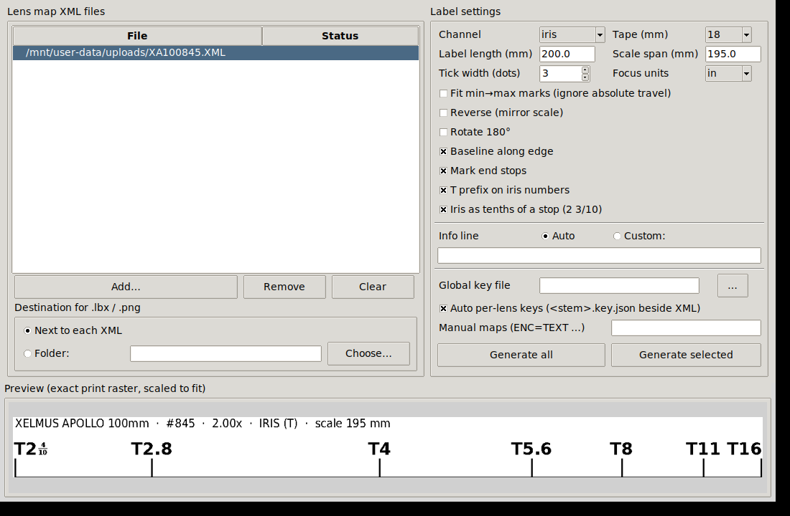
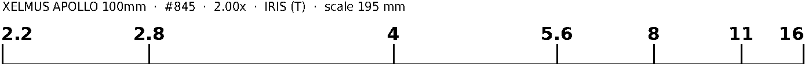

# lensmap2lbx

Turn FIZ lens-map XML files (motor position → encoded lens value) into
precision **Brother P-touch scale labels** (`.lbx`), mapping every iris or
focus mark of a cine lens onto a printable strip.





The label is rendered as a 1-bit bitmap at exactly **180 dpi** — the fixed
P-touch print resolution — so every tick lands on the exact printer dot for
its motor position (±half a dot, ~70 µm). The `.lbx` container mirrors a file
saved by P-touch Editor itself and opens there as a normal project. A `.png`
preview written next to each `.lbx` is the *identical* raster that prints.

## Features

- **Iris decoding** — `<encoded>` is an index into an f-number table:
  `f = (encoded + 7) / 10` up to T8 (0.1-stop steps), whole stops above
  (`f = encoded − 65`). Per-lens key files override any mark
  (`{"16": "2.2"}`) for rings whose engraving differs from the table.
- **Focus decoding** — distance in inches (`65535` = ∞), printed as feet
  and inches or centimetres.
- **Tenths-of-a-stop mode** — iris values as a light meter reads them:
  `T2.2 → T2 ³⁄₁₀` with a stacked vertical fraction; nominal third-stop
  engravings (2.2, 3.2, 9, 13 …) snap to 3/10 and 7/10.
- **End stops** — when a barrel travels past its outermost mark, the motor
  travel limits (0 / 65535) print as unlabeled brackets.
- Bottom-edge ticks reaching the last printable dot row, auto collision
  handling for crowded marks, scale mirroring and 180° rotation, tape
  widths 6 / 9 / 12 / 18 / 24 mm.
- **GUI** with live preview and batch conversion of many XMLs to a chosen
  destination; per-lens `*.key.json` files are picked up automatically.

## Download

Ready-made apps for macOS and Windows are on the
[Releases](../../releases) page — no Python required. macOS releases are
signed and notarized when the repo's signing secrets are configured (see
[docs/notarization.md](docs/notarization.md)); unsigned builds need
right-click → Open on first launch.

## Run from source

Needs Python 3.9+ and Pillow (`pip install pillow`).

```
python3 lensmap2lbx_gui.py                 # GUI
python3 lensmap2lbx.py LENSMAP.XML         # CLI, see --help for all flags
```

CLI examples:

```
# 18 mm tape, absolute 0–65535 travel on a 195 mm scale (defaults)
python3 lensmap2lbx.py examples/XA100845.XML --key examples/XA100845.key.json

# meter-style tenths with T prefix
python3 lensmap2lbx.py examples/XA100845.XML --iris-tenths --t-prefix

# focus scale in feet/inches on 12 mm tape
python3 lensmap2lbx.py examples/XA100845.XML --channel focus --tape 12
```

## Building the apps yourself

```
pip install pillow pyinstaller
pyinstaller lenslabels.spec
```

macOS produces `dist/LensLabels.app`, Windows `dist/LensLabels/`. The
GitHub Actions workflow in `.github/workflows/build.yml` does the same on
every version tag (`git tag v1.0.1 && git push --tags`) and attaches both
zips to a release.

DejaVu fonts are bundled (`fonts/`, free license included) so labels render
with identical metrics on every machine.

## Accuracy notes

Digital tick placement is exact to ±half a printer dot (~70 µm at 180 dpi).
Over a 200 mm label the dominant physical error source is the printer's tape
feed, not the raster. The print head does not reach the tape edges: on 18 mm
tape ~1.1 mm per side is unprintable hardware margin, so ticks end that far
from the physical edge.

## License

MIT — see [LICENSE](LICENSE). Bundled DejaVu fonts carry their own free
license in [fonts/LICENSE](fonts/LICENSE).
